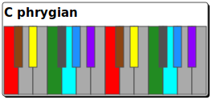
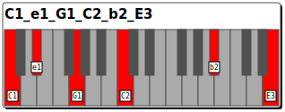
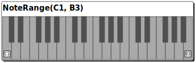

# musiclib
set of tools to work with scales, modes, modulations, chord progressions, voice leading, rhythm and more

## install
### install from [pypi](https://pypi.org/project/musiclib/)
```sh
pip install musiclib
```

### or install the latest version from github
```sh
pip install git+https://github.com/tandav/musiclib
```

### development
```sh
pip install -e .[dev]
```

## examples

```py
>>> from musiclib.scale import Scale
>>> from musiclib.chord import Chord

>>> scale = Scale.from_name('C', 'major')

>>> scale.root
Note(name=C)

>>> scale.notes
frozenset({Note(name=C),
           Note(name=D),
           Note(name=E),
           Note(name=F),
           Note(name=G),
           Note(name=A),
           Note(name=B)})

>>> scale.bits
'101011010101'

>>> scale.intervals
frozenset({0, 2, 4, 5, 7, 9, 11})

>>> scale.triads
(CEG/C, DFA/D, EGB/E, FAC/F, GBD/G, ACE/A, BDF/B)

>>> chord = Chord.from_str('CEG/C')
>>> chord == scale.triads[0]
True
```

```py
Scale.from_name('C', 'phrygian')
```


```py
SpecificChord.from_str('C1_e1_G1_C2_b2_E3')
```


```py
NoteRange(SpecificNote('C', 1), SpecificNote('B', 3))
```

